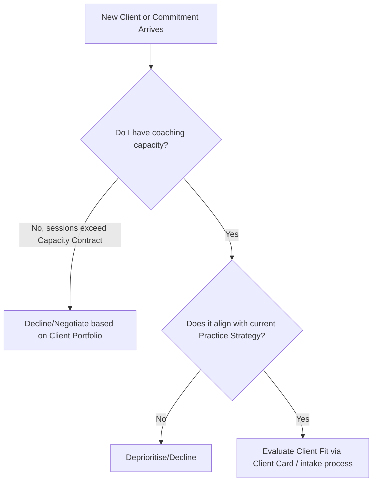

# Coach Decision Protocol

> **Layer:** KERNEL  
> **Owner:** [Your Name]  
> **Version:** 2026.02  
> **Last Updated:** [YYYY-MM-DD]  
> **Portable:** Yes

---

## What Is This File?

**Decision Protocol** is your conflict resolution logic — how you choose between competing priorities when they clash. It defines the 3-gate hierarchy (Capacity → Practice Strategy → Client Fit) and enforcement rules.

This file is used when:
- Handling `client_request` — which new clients or commitments to accept
- Running `boundary_check` — how to resolve conflicts or scope creep
- Planning `prep_program` — prioritizing your programme design

**Update frequency:** Rarely (foundational; built during SETUP_WIZARD)  
**Used by:** `client_request`, `boundary_check`, `prep_program`  
**Core concept:** Rule Zero ("When in doubt, talk in person") + 3-gate hierarchy

---

**Purpose:** To resolve conflicts and guide execution using the Coach Operating System (COS) files.

## 0. Rule Zero: The Human Handshake (Default to Speak)

* **Principle:** This OS is a *decision-support* tool, not a decision-maker. It calculates trade-offs, but humans make the call.
* **The Trigger:** If the rules below result in a logical conflict, ambiguity, or a "bad gut feeling," the system halts.
* **The Action:**
    1. Stop the async/logic flow.
    2. **Speak:** Have a synchronous conversation — with the client, a peer coach, or a supervisor as appropriate.
    3. **Goal:** Use the OS outputs (Pros/Cons) as the agenda, but decide face-to-face.
* **Override Authority:** Any human can invoke Rule Zero at any time. It cannot be overridden by any other rule.

---

## 1. The Hierarchy of Precedence (Order of Operations)

When making a decision, apply constraints in this specific order (Local $\rightarrow$ Global):

1. **Level 1: The Capacity Contract (Local Context)**
    * *Why?* Your coaching calendar is the execution unit. Your bandwidth determines *if* you can take on new work at the quality you promise.
    * *Rule:* If a request violates the **Capacity Contract** (defined in Client Portfolio §4), it is blocked, regardless of how compelling the opportunity appears (unless it's a genuine emergency for an existing client).
2. **Level 2: Practice Strategy (Global Direction)**
    * *Why?* If you have capacity, the work must align with where your practice is headed.
    * *Rule:* Choose the path that maximises your **Practice Strategy** North Star (niche focus, revenue target, impact goal).
3. **Level 3: Client Fit (Personal Context)**
    * *Why?* Long-term coaching relationships require genuine mutual fit.
    * *Rule:* Match the engagement to the client's goals and your competence, using the **Client Card** (Career Profile, Goals, Communication Preferences).

---

## 2. Interaction Rules (The API)

### Rule A: The "Override" Function

* **Scenario:** Your practice values say "slow, deep coaching relationships," but an opportunity arrives for a high-volume corporate programme at compelling revenue.
* **Logic:** The **Client Portfolio** principles override the business opportunity for *how* you engage.
  * *Result:* You can pursue the programme *if* you can maintain your session quality standards. You do not compromise your Coaching Standards (COS §10).

### Rule B: The "Conflict" Function

* **Scenario:** Two prospective clients compete for the same slot, or two opportunities consume the same bandwidth.
* **Logic:**
    1. Check **Practice Strategy**: Which client or programme aligns better with your current quarter's North Star?
    2. Check **Client Portfolio**: Does one engagement reduce "Hidden Admin" (ops overhead) relative to the other?
    3. **Decision:** Prioritise the intersection of Strategic Alignment + Low Overhead.

### Rule C: The "Exception" Function

* **Scenario:** An existing long-term client is in genuine crisis (redundancy, mental health emergency, a critical career juncture).
* **Logic:** **Suspend normal scheduling rules.**
  * Switch to **Supportive Coaching Mode** (COS §5).
  * Defer non-urgent admin or business development.
  * Restore standard protocols immediately after the acute phase passes.
  * If the situation exceeds coaching scope → trigger `boundary_check`.

---

## 3. Execution Loops

### The "New Request" Loop

---

## 4. Decision Speed (Reversibility Check)

* **Reversible Decisions:** Make them fast. A single exploratory conversation with a prospect, trying a new session format, adjusting a programme structure mid-engagement — bias toward action.
* **Irreversible Decisions:** Require a clear-eyed review before committing. Examples: signing a year-long corporate contract, publicly announcing a niche pivot, ending an ongoing client relationship. If in doubt, invoke Rule Zero.
