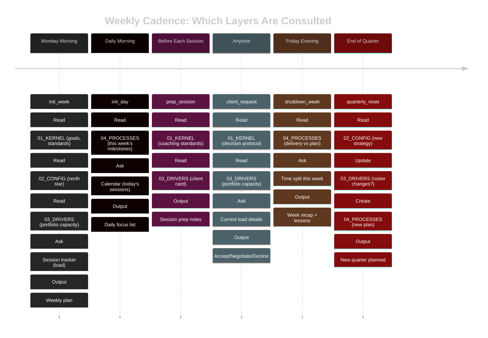

# Architecture — Coach Operating System (COS)

**For new coaches:** This document shows visually how the COS works — the layers, how they connect, how data flows, and when each layer is consulted.

---

## 1. Layer Hierarchy & Information Flow

This shows how the OS is structured and how information flows from your setup through daily execution.

```mermaid
%%{init: {'theme':'dark'}}%%
graph TD
    A["📖 00_BOOT<br/>System Manual & Onboarding"] --> B["⚙️ 01_KERNEL<br/>Your Portable Coaching Philosophy"]
    B --> C["🏢 02_CONFIG<br/>Practice Identity & Strategy"]
    C --> D["👥 03_DRIVERS<br/>Client Portfolio & Cards"]
    D --> E["📅 04_PROCESSES<br/>Current Quarter Plan"]
    E --> F["🎮 05_COMMANDS<br/>AI Interface Layer"]
    F --> G["🧠 06_BOARDROOM<br/>Virtual Advisory Council"]
    G -.->|executes| H["AI Copilot<br/>ChatGPT / Gemini / Claude"]
    F -.->|executes| H

    style A fill:#404040
    style B fill:#404040
    style C fill:#404040
    style D fill:#404040
    style E fill:#404040
    style F fill:#404040
    style G fill:#404040
    style H fill:#404040
```



**What each layer does:**
- **00_BOOT** — Teaches you the system (you read this once)
- **01_KERNEL** — Your personal coaching DNA (permanent, portable)
- **02_CONFIG** — Your practice identity, niche, and strategy (changes when you pivot)
- **03_DRIVERS** — Your current client portfolio and cards (changes when roster changes)
- **04_PROCESSES** — Your current quarter's programme plan (changes every quarter)
- **05_COMMANDS** — The operations that glue everything together via AI
- **06_BOARDROOM** — Your virtual advisory council (permanent, portable — personas travel with you)

---

## 2. Complete System Graph — Files, Commands & Data Sources

This shows how all the pieces connect: which files feed into which commands, and where external data comes from.

```mermaid
%%{init: {'theme':'dark'}}%%
graph LR
    subgraph Kernel["🔷 KERNEL (Portable - travels with you)"]
        K1["Coach OS<br/>Philosophy & Standards"]
        K2["Decision Protocol<br/>Gate Logic & Rules"]
        K3["Personal DNA<br/>Goals & Patterns"]
    end

    subgraph Config["🔶 CONFIG (Practice-level)"]
        C1["Practice OS<br/>Mission, Niche & Values"]
        C2["Practice Strategy<br/>North Star & OKRs"]
    end

    subgraph Drivers["🟢 DRIVERS (Portfolio-level)"]
        D1["Client Portfolio<br/>Roster, Capacity<br/>& Referral Network"]
        D2["Client Cards<br/>Individual Profiles"]
    end

    subgraph Processes["🔴 PROCESSES (Quarterly)"]
        P1["Quarterly Plan<br/>Programme & Risks"]
    end

    subgraph Commands["⚫ COMMANDS (AI Operations)"]
        CMD1["init_week<br/>Plan week"]
        CMD2["prep_session<br/>Session prep"]
        CMD3["client_request<br/>Decision gate"]
        CMD4["capacity_check<br/>Load check"]
        CMD5["boundary_check<br/>Scope & ethics"]
        CMD6["boardroom<br/>Advisory council"]
    end

    subgraph Boardroom["🧠 BOARDROOM (Portable - travels with you)"]
        B1["Boardroom<br/>Personas & Principles"]
    end

    subgraph External["🌐 DATA SOURCES (External Tools)"]
        EXT1["Sessions & Notes<br/>(Ex. Notion / Google Docs)"]
        EXT2["Milestones & Goals<br/>(Ex. Airtable / Notion)"]
        EXT3["Comms<br/>(Ex. Email / Slack)"]
    end

    K1 --> CMD1
    K2 --> CMD3
    K3 --> CMD2
    C2 --> CMD1
    D1 --> CMD4
    D2 --> CMD2
    P1 --> CMD1
    B1 --> CMD6

    CMD1 -.->|queries| EXT2
    CMD2 -.->|references| EXT1
    CMD3 -.->|queries| EXT2
    CMD4 -.->|queries| EXT1
    CMD2 -.->|references| EXT3

    style Kernel fill:#404040,stroke:#ff9800,stroke-width:3px
    style Config fill:#404040,stroke:#9c27b0,stroke-width:3px
    style Drivers fill:#404040,stroke:#4caf50,stroke-width:3px
    style Processes fill:#404040,stroke:#e91e63,stroke-width:3px
    style Commands fill:#404040,stroke:#333,stroke-width:2px
    style External fill:#404040,stroke:#009688,stroke-width:2px
    style Boardroom fill:#404040,stroke:#2196f3,stroke-width:3px
```



**Key insight:**
- **Solid arrows** = files read at setup time
- **Dotted arrows** = commands query external data on-demand
- **Each command** pulls context from multiple layers, then asks for live data to fill gaps

---

## 3. Lifecycle — When Each Layer Is Active

This shows what happens during a typical week, and which layers you consult at each stage.



---

## 4. Command Execution Details — What Each Command Reads & Asks For

This table shows the logic: what context does each command read, what data does it request, and what does it output?

| Command | Reads from | Asks You For | Queries | Output |
|---------|-----------|--------------|---------|--------|
| `init_week` | KERNEL §8,9,12 + CONFIG §1 + DRIVERS §2,4,5,6,7 + all client cards §3 | Availability, carryover, blockers | Session tracker | Weekly plan + per-client focus |
| `init_day` | PROCESSES §1 + DRIVERS §5 + KERNEL §4,12 | Today's calendar, carryover | — | Daily priority list |
| `shutdown_day` | KERNEL §4,9,12 + DNA Constraints | Done vs planned, open threads | — | Progress recap + patterns |
| `shutdown_week` | KERNEL §8,9,12 + DRIVERS §4 + PROCESSES §1,2 | Time split, client highlights | — | Week summary + exec summary |
| `prep_session [name]` | KERNEL §2,5,6 + DRIVERS client card | Previous session notes, feedback | — | Session agenda + coaching mode |
| `onboard_client [name]` | KERNEL §1,2,6,10 + DRIVERS portfolio | Intake data, preferences, goals | — | Draft client card + welcome brief |
| `prep_program` | KERNEL §10 + DRIVERS §2,4,6,7 + PROCESSES | Candidate initiatives, constraints | Goals tracker | Planning framework + priorities |
| `capacity_check` | DRIVERS §2,4 + KERNEL §3,8 + PROCESSES | Time split this period | Session log | Ratio analysis + circuit breaker |
| `retro` | KERNEL §1,5,6,7 + DRIVERS §4,5,6 + PROCESSES | Wins, friction, prior actions | — | Reflection guide + experiments |
| `client_request [desc]` | KERNEL Decision Protocol + DRIVERS §2,4,7 + CONFIG §1 + PROCESSES | Effort, requestor, reversibility | — | Gate analysis + ACCEPT/NEGOTIATE/DECLINE |
| `boundary_check [topic]` | KERNEL §10,12 + Decision Protocol §0,1,4 | Context, concern type | — | Safe-action plan + referral options |
| `quarterly_reset` | CONFIG + KERNEL + DRIVERS + PROCESSES | New strategy, roster changes | — | New Q plan template |
| `boardroom [topic]` | BOARDROOM §1,2,3 + KERNEL DNA + COS §12 | Topic, session depth | — | Multi-persona advisory + synthesis |

---

## 5. Data Flow — How External Tools (Notion, Airtable, Email) Connect

This shows where the "live" data comes from and how commands use it.

```mermaid
%%{init: {'theme':'dark'}}%%
graph LR
    subgraph COS["📚 COS Knowledge Base<br/>(Markdown files)"]
        M1["01_KERNEL<br/>Decision logic"]
        M2["03_DRIVERS<br/>Portfolio context"]
        M3["04_PROCESSES<br/>Programme direction"]
        M4["06_BOARDROOM<br/>Advisory personas"]
    end

    subgraph CMD["🎮 Commands<br/>(AI operations)"]
        C1["init_week"]
        C2["capacity_check"]
        C3["client_request"]
    end

    COS -->|context| CMD

    subgraph EXT["🌐 External Data<br/>(Source of Truth)"]
        N["Notion / Docs<br/>Session notes<br/>Client history<br/>Action tracking"]
        A["Airtable / Notion<br/>Goal tracking<br/>Programme milestones<br/>Progress metrics"]
        E["Email / Calendar<br/>Client comms<br/>Session scheduling"]
    end

    C1 -.->|queries| A
    C2 -.->|queries| N
    C3 -.->|queries| A
    C3 -.->|queries| N

    CMD -->|produces output| USER["👤 Coach<br/>Makes decision<br/>or runs session"]

    USER -->|logs outcomes| N
    USER -->|updates goals| A

    style COS fill:#404040,stroke:#ff9800,stroke-width:3px
    style CMD fill:#404040,stroke:#333,stroke-width:2px
    style EXT fill:#404040,stroke:#009688,stroke-width:2px
    style USER fill:#404040,stroke:#9c27b0,stroke-width:2px
```



**Critical principle:**
> **Notion/Airtable/Email are the "database" (source of truth for data). COS files are the "code" (source of truth for logic).**
>
> Commands ask: "What logic should I apply?" (reads COS) → "What data is current?" (queries Notion/Airtable/Email) → "What should we do?" (outputs recommendation to you).

---

## 6. Portability Model — What Travels When You Change Niche or Model

This shows which layers move with you and which get replaced.

```mermaid
%%{init: {'theme':'dark'}}%%
graph TD
    YOU["👤 You (the coach)"]

    subgraph Keep["✅ KEEP — Travels with you"]
        K["01_KERNEL<br/>Your philosophy<br/>Your decision rules<br/>Your personal DNA"]
        C["05_COMMANDS<br/>Your operations<br/>Command definitions"]
        B["06_BOARDROOM<br/>Your advisory council<br/>Persona definitions"]
    end

    subgraph Update["🔄 UPDATE — New practice direction only"]
        UC["02_CONFIG<br/>New niche / mission<br/>New strategy"]
    end

    subgraph Replace["🗑️ REPLACE — New roster only"]
        R1["03_DRIVERS<br/>New client portfolio<br/>New capacity model"]
        R2["04_PROCESSES<br/>New quarterly plan"]
    end

    YOU -->|change niche or model| Update
    YOU -->|change client roster| Replace
    YOU -->|always have| Keep

    style Keep fill:#404040,stroke:#4caf50,stroke-width:3px
    style Update fill:#404040,stroke:#fbc02d,stroke-width:2px
    style Replace fill:#404040,stroke:#ff5722,stroke-width:2px
    style YOU fill:#404040,stroke:#9c27b0,stroke-width:2px
```



**Translation:**
- New niche, same clients? Update CONFIG only.
- Same niche, new client cohort? Replace DRIVERS + PROCESSES. Note: Referral Network (DRIVERS §7) includes a "Carries Over" flag — review which relationships survive across cohorts.
- Everything changes (career pivot)? You keep KERNEL + COMMANDS, rebuild everything else (10x faster because you have your playbook).

---

## 7. Decision Protocol Flow — How the 3-Gate System Works

This shows how the Decision Protocol (KERNEL §1) applies layered gates when a new client request or scope change arrives.

```mermaid
%%{init: {'theme':'dark'}}%%
graph TD
    REQ["📬 New Request Arrives<br/>(Client? New programme? Scope change?)<br/>From: Lead or existing client"]

    GATE1{"Gate 1: Capacity<br/>(from DRIVERS §4)<br/><br/>Do I have coaching<br/>hours available?"}

    GATE2{"Gate 2: Practice Strategy<br/>(from CONFIG §1)<br/><br/>Does it align with<br/>my niche and goals?"}

    GATE3{"Gate 3: Client Fit<br/>(from DRIVERS cards)<br/><br/>Is this the right person<br/>at the right time?"}

    ACCEPT["✅ ACCEPT<br/>Add to roster / programme"]
    NEGOTIATE["🤝 NEGOTIATE<br/>Pre-filled script<br/>from KERNEL §3"]
    DECLINE["❌ DECLINE<br/>Graceful referral<br/>from KERNEL §3"]
    WAIT["⏸️ WAITLIST<br/>Flag for next quarter"]

    REQ --> GATE1
    GATE1 -->|Yes - capacity available| GATE2
    GATE1 -->|No - at capacity| WAIT
    GATE2 -->|Aligned| GATE3
    GATE2 -->|Misaligned| NEGOTIATE
    GATE3 -->|Strong fit| ACCEPT
    GATE3 -->|Partial fit| NEGOTIATE
    GATE3 -->|Poor fit| DECLINE

    style REQ fill:#404040,stroke:#9c27b0
    style GATE1 fill:#404040,stroke:#fbc02d
    style GATE2 fill:#404040,stroke:#fbc02d
    style GATE3 fill:#404040,stroke:#fbc02d
    style ACCEPT fill:#404040,stroke:#4caf50
    style NEGOTIATE fill:#404040,stroke:#ff9800
    style DECLINE fill:#404040,stroke:#f44336
    style WAIT fill:#404040,stroke:#607d8b
```



---

## 8. Quick Reference Guide

Summary of all layers, files, their roles, and key protocols at a glance.

```mermaid
%%{init: {'theme':'dark'}}%%
graph LR
    subgraph Boot["00_BOOT - System Manual"]
        B1["README.md<br/>Architecture + protocols"]
        B2["bootstrap_prompt.md<br/>Static AI custom instructions"]
    end

    subgraph Kernel["01_KERNEL - Portable Philosophy"]
        K1["coach_operating_system.md<br/>Philosophy · No Logic<br/>Coaching Mode · Standards<br/>Pressure Mode"]
        K2["coach_decision_protocol.md<br/>Rule Zero · Gates<br/>New Request Loop · Speed"]
        K3["personal_dna.md<br/>Identity · Niche · Goals<br/>Fears · Greeting"]
    end

    subgraph Config["02_CONFIG - Practice Context"]
        C1["practice_operating_system.md<br/>Mission · Values · Niche<br/>Ideal Client · Offerings"]
        C2["practice_strategy.md<br/>North Star · OKRs<br/>Service Line Focus"]
    end

    subgraph Drivers["03_DRIVERS - Current Portfolio"]
        D1["client_portfolio.md<br/>Roster · Capacity Contract<br/>Rituals · Referral Network"]
        D2["client_card - Name.md<br/>Career Profile · Goals<br/>Comms Prefs · Session Log"]
    end

    subgraph Processes["04_PROCESSES - Current Quarter"]
        P1["quarterly_plan.md<br/>Theme · Goals · Milestones<br/>Risks · Mitigations"]
    end

    subgraph Commands["05_COMMANDS - AI Interface"]
        CMD1["command_reference.md<br/>14 command definitions<br/>with output templates"]
        CMD2["system_prompt.md<br/>AI operating instructions<br/>freshness validation rules"]
    end

    subgraph Boardroom["06_BOARDROOM - Advisory Council"]
        BM["boardroom.md<br/>6 coaching-domain personas<br/>Working principles · Coach Chair"]
    end

    Boot --- Kernel
    Kernel --- Config
    Config --- Drivers
    Drivers --- Processes
    Processes --- Commands
    Commands --- Boardroom

    style Boot fill:#404040,stroke:#607d8b,stroke-width:2px
    style Kernel fill:#404040,stroke:#ff9800,stroke-width:3px
    style Config fill:#404040,stroke:#9c27b0,stroke-width:3px
    style Drivers fill:#404040,stroke:#4caf50,stroke-width:3px
    style Processes fill:#404040,stroke:#e91e63,stroke-width:3px
    style Commands fill:#404040,stroke:#333,stroke-width:2px
    style Boardroom fill:#404040,stroke:#2196f3,stroke-width:3px
```



**Key Protocols Quick Reference:**

| Protocol | File | Purpose |
|----------|------|---------|
| **Commands** | Command Reference | Named operations — `init_week`, `prep_session`, `client_request`, etc. |
| **Rule Zero** | Decision Protocol §0 | Human override — when in doubt, talk directly to the client |
| **Capacity Contract** | COS §3 + Portfolio §4 | Protect coaching hours from scope creep and admin overload |
| **Pressure Mode** | COS §12 | Self-management when stress compromises coaching judgment |
| **Coaching Mode Selector** | COS §5 | Situational mode switch (Exploratory, Directive, Accountability, Supportive, Facilitative) |
| **The "No" Logic** | COS §3 | How to decline requests that violate capacity or client fit |
| **Boundary Check** | `boundary_check` command | Scope, ethics, and role-confusion flag — the safety circuit breaker |

---

## Deployment Options

### Option 1: Individual Files (Recommended for most coaches)

Upload each `.md` file individually to your AI platform. Best for: ChatGPT Projects, Claude Projects.

```
Upload: all .md files → AI platform
Paste:  bootstrap_prompt.md → Custom Instructions
Test:   init_week
```

### Option 2: Bundled Single File

Run `scripts/bundle.sh` to generate `bundle/cos_compiled.md`. Upload this single file. Best for: Gemini Gems (file-count limited), or any platform where reducing upload complexity matters.

```
Run:    scripts/bundle.sh
Upload: bundle/cos_compiled.md → AI platform
Paste:  bootstrap_prompt.md → Custom Instructions
Test:   init_week
```

### Option 3: Manual (No AI)

Read the files directly and apply the decision frameworks manually. Useful during offline work, travel, or platform limitations.

```
Read:  01_KERNEL/ for decisions under pressure
Read:  03_DRIVERS/ for client context
Apply: Decision Protocol gates manually
```

